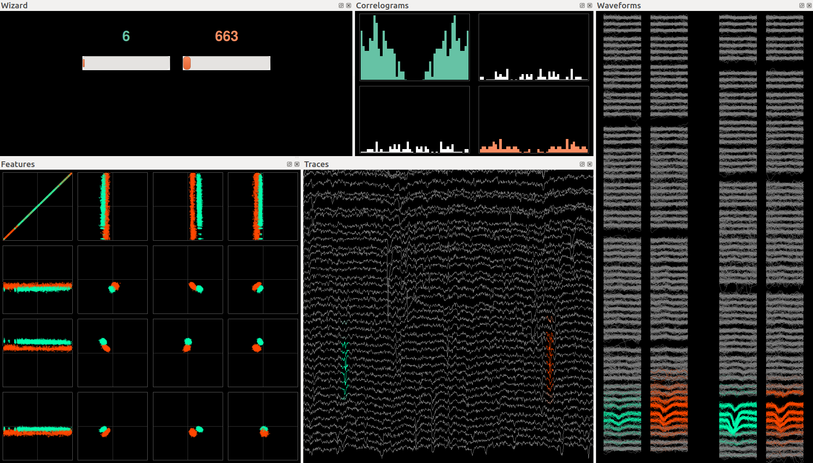

## Manual clustering

The manual clustering subpackage (`phy.cluster.manual`) is the main component of phy 0.1.0. It provides a programmatic Python API as well as a lightweight graphical interface to manually refine the automatic clustering.

There is a light command-line tool to start the GUI on a dataset. Type the following in a terminal: `phy cluster manual myexperiment.kwik`. Add `-i` to start an IPython console at the same time.

In the following, we describe the API in case you want more control on the process.

### Session

The `Session` is the main interface to the manual clustering engine. Use tab completion in IPython to discover the methods. See also the [API documentation](https://github.com/kwikteam/phy-doc/blob/master/api.md#phyclustermanualsession).

#### Activating Qt event loop integration in IPython

**Important**: if you use the GUI in the notebook, don't forget to do this at the beginning:

```python
>>> import phy
>>> phy.enable_qt()
2015-05-21 13:37:39  dock:144                Qt event loop activated.
```

You can also type `%gui qt`.

#### Starting a session

Let's create a new manual clustering session using an already automatically clustered dataset:

```python
>>> from phy.cluster.manual import Session
```

```python
>>> kwik_path = 'myexperiment.kwik'
>>> session = Session(kwik_path)
Features and masks initialized.
Waveforms initialized.
Statistics initialized.
```

> Putting your data files on a SSD is **highly recommended** for performance reasons.

This may take a while the first time, because a **cluster store** is automatically created. This folder in `myexperiment.phy/cluster_store/` contains a copy of all masks, features, and part of the waveforms for every cluster (one file per cluster). This makes the GUI orders of magnitude faster than fetching data from the HDF5 kwik files. The cluster store is transparently handled by the engine and you don't have to worry about it. The cluster store is also used to compute various cluster statistics at initialization time so that the interface is fast during manual clustering.

Oncce the session is loaded, you can view the data and start clustering it. See the API documentation for more details.

### Objects

There are several objects accessible from the session. See the API documentation for more details.

#### Model

This is documented earlier in the user guide, as well as in the API documentation:

```python
>>> session.model
<phy.io.kwik.model.KwikModel at 0x7fc8d79a5710>
```

#### Clustering

The `Clustering` object handles the spike-cluster mapping:

```python
>>> session.clustering
<phy.cluster.manual.clustering.Clustering at 0x7fc9256afc50>
```

The following two dictionaries can be useful:

```python
>>> session.clustering.cluster_counts
{2: 553,
 3: 188,
 4: 708,
 ...
 23: 360,
 24: 825,
 25: 418}
```

```python
>>> session.clustering.spikes_per_cluster
{2: array([   44,    68,   131,   133,   213,   224,   235,   364,   399,
           ...
            18480, 18484, 18485, 18521])}
```

These dictionaries are always up to date with the current manual clustering.

#### Other objects

In general you don't need to use these objects directly.

```python
>>> session.view_creator
<phy.cluster.manual.views.ViewCreator at 0x7fc8d79a5438>
```

```python
>>> session.gui_creator
<phy.cluster.manual.gui.GUICreator at 0x7fc8d79a55f8>
```

```python
>>> session.wizard
<phy.cluster.manual.wizard.Wizard at 0x7fb708337668>
```

### Wizard GUI

Type `session.show_gui()` to launch the clustering GUI. This minimal GUI provides two things:

* A window where to dock visualization widgets.
* Keyboard shortcuts to go through your best clusters and a list of potential merge candidates (**wizard**).

> Type `ctrl+h` to see the list of keyboard shortcuts.

The wizard is there to save you a lot of time clustering your data manually. It makes you propositions with 1 or 2 clusters, and you have to decide an outcome based on the views in the window.

Here is the intended workflow:

* Initially, the **best** cluster found is shown. You can explore it in the various views (waveforms, features, traces, ACG).
* Use `space` and `shift+space` to scroll through your best clusters by decreasing quality.
* At any point, you can **pin** a cluster by pressing `enter`. Then you'll see a second cluster selected: this is the **closest match**. Unpin with `backspace`.
* When a cluster is pinned, scroll through the list of closest matches with `space` and `shift+space`. The pinned cluster stays selected.
* You have keyboard shortcuts to:
    * Merge the two displayed clusters.
    * Move either or both clusters to cluster groups (noise, MUA, good).
* You can also draw a lasso in the feature view to create a new cluster out of the enclosed spikes (`ctrl+click` and `k` to split).

> Better quality and similarity measures will be used in the future. You'll also be able to write your own functions in Python.



All actions are accessible from the Python API. Use tab completion on `session.gui` and look at the [API](https://github.com/kwikteam/phy-doc/blob/master/api.md#phyclustermanualclustermanualgui).

```python
>>> gui = session.show_gui()
```

### The cluster store

The cluster stores contains a copy of the features, masks, waveforms of your data, in a format much more adapted to manual clustering. This makes the progam much faster than before. You can also use it to access per-cluster data and statistics.

#### Masks and features

```python
>>> store = session.cluster_store
```

```python
>>> store.display_status()
Cluster store status (/data/spikesorting/1_simple120sec/test_hybrid_120sec.phy/cluster_store/0/main)
----------------------------------------------------------------------------------------------------
Number of clusters in the store     24
Number of old clusters               0
Total size (MB)                     18
Consistent                        True
```

You can obtain the features and masks of all spikes in any given cluster very efficiently:

```python
>>> store.masks(3).shape
(188, 32)
```

```python
>>> store.features(5).shape
(260, 32, 3)
```

#### Waveforms

Only a subset of the waveforms (those that are displayed) are stored:

```python
>>> store.waveforms(3).shape
(100, 32, 32)
```

Here are the corresponding spikes:

```python
>>> store.waveforms_spikes(3)
array([  152,   171,   173,   284,   695,   801,   829,   831,   927,
        ...
       17331, 17332, 17411, 17728, 17881, 17883, 18127, 18139, 18184, 18233])
```

#### Cluster statistics

There are also some basic cluster statistics, computed and stored in RAM when you load a dataset:

```python
>>> store.mean_masks(3)
array([  5.53777814e-03,   7.00678080e-02,   6.73059449e-02,
         ...
         3.20874620e-03,   3.55315686e-04], dtype=float32)
```

```python
>>> store.mean_probe_position(3)
array([ -1.71710563,  26.0843029 ], dtype=float32)
```

```python
>>> store.mean_features(3)
array([  6.89437687e-01,   1.20974028e+00,   1.33888766e-01,
         ...
         1.01085186e+00,   8.73123109e-01,   2.94472277e-01], dtype=float32)
```

A cluster store contains several **store items**: these objects are responsible for storing some data. Here are the default store items:

```python
>>> store.store_items
[<phy.io.kwik.store_items.FeatureMasks at 0x7f72e630bac8>,
 <phy.io.kwik.store_items.Waveforms at 0x7f72e630b9b0>,
 <phy.io.kwik.store_items.ClusterStatistics at 0x7f72e6333358>]
```

```python
>>> stats = store.get_item('statistics')
```

Every store items contains a list of **fields** which represents one particular bit of data, stored either on disk or in memory. For example, the statistics item contains the following default statistics:

```python
>>> stats.fields
[('mean_masks', 'memory'),
 ('sum_masks', 'memory'),
 ('n_unmasked_channels', 'memory'),
 ('main_channels', 'memory'),
 ('mean_probe_position', 'memory'),
 ('mean_features', 'memory'),
 ('mean_waveforms', 'memory')]
```

We'll see below how to customize these objects.

### Extending and customizing the interface

#### Using custom statistics in the wizard

#### Integrating your analyses in the engine

#### User parameters

#### Internal settings
