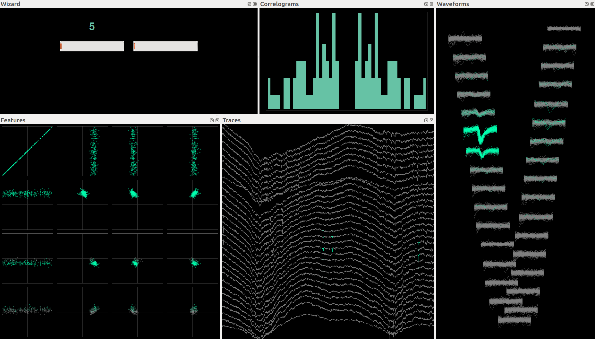

# Quick start guide

Here is a short tutorial for phy, focusing on manual clustering.

## Installation

https://github.com/kwikteam/phy-doc/blob/master/install.md

## Importing phy

```python
>>> import phy
>>> # Necessary when using the manual clustering GUI in the notebook:
... phy.enable_qt()
2015-05-26 14:31:28  dock:142                Qt event loop activated.
```

## Downloading a test dataset

Let's download a test dataset in Kwik format:

```python
>>> phy.download_test_data('test_hybrid_120sec')
2015-05-26 14:31:30  datasets:50             Downloading http://phy.cortexlab.net/data/test_hybrid_120sec.kwik...
2015-05-26 14:31:30  datasets:50             Downloading http://phy.cortexlab.net/data/test_hybrid_120sec.kwx...
2015-05-26 14:31:42  datasets:50             Downloading http://phy.cortexlab.net/data/test_hybrid_120sec.raw.kwd...
```

This creates a `test_hybrid_120sec` subdirectory with three files:

```python
>>> %ls test_hybrid_120sec
test_hybrid_120sec.kwik*  test_hybrid_120sec.kwx*  test_hybrid_120sec.raw.kwd*
```

## Creating a manual clustering session

```python
>>> from phy.cluster.manual import Session
```

We create a `Session` and pass the path to the `.kwik` file:

```python
>>> session = Session('test_hybrid_120sec/test_hybrid_120sec.kwik')
2015-05-26 14:31:48  session:117             Saving a backup of the Kwik file in test_hybrid_120sec/test_hybrid_120sec.kwik.bak.
Features and masks initialized.
Features and masks initialized.
Waveforms initialized.
Statistics initialized.
```

**Side note**: A backup of the `.kwik` file has been automatically-created, as well as an internal cluster store that acts as a cache (needed for performance reasons):

```python
>>> %ls test_hybrid_120sec/test_hybrid_120sec.phy/cluster_store/0/main
10.features*        16.masks*           21.mean_features*   4.mean_masks*
10.masks*           16.mean_features*   21.mean_masks*      4.mean_waveforms*
10.mean_features*   16.mean_masks*      21.mean_waveforms*  4.waveforms*
10.mean_masks*      16.mean_waveforms*  21.waveforms*       5.features*
10.mean_waveforms*  16.waveforms*       22.features*        5.masks*
10.waveforms*       17.features*        22.masks*           5.mean_features*
11.features*        17.masks*           22.mean_features*   5.mean_masks*
11.masks*           17.mean_features*   22.mean_masks*      5.mean_waveforms*
11.mean_features*   17.mean_masks*      22.mean_waveforms*  5.waveforms*
11.mean_masks*      17.mean_waveforms*  22.waveforms*       6.features*
11.mean_waveforms*  17.waveforms*       23.features*        6.masks*
11.waveforms*       18.features*        23.masks*           6.mean_features*
12.features*        18.masks*           23.mean_features*   6.mean_masks*
12.masks*           18.mean_features*   23.mean_masks*      6.mean_waveforms*
12.mean_features*   18.mean_masks*      23.mean_waveforms*  6.waveforms*
12.mean_masks*      18.mean_waveforms*  23.waveforms*       7.features*
12.mean_waveforms*  18.waveforms*       24.features*        7.masks*
12.waveforms*       19.features*        24.masks*           7.mean_features*
13.features*        19.masks*           24.mean_features*   7.mean_masks*
13.masks*           19.mean_features*   24.mean_masks*      7.mean_waveforms*
13.mean_features*   19.mean_masks*      24.mean_waveforms*  7.waveforms*
13.mean_masks*      19.mean_waveforms*  24.waveforms*       8.features*
13.mean_waveforms*  19.waveforms*       25.features*        8.masks*
13.waveforms*       2.features*         25.masks*           8.mean_features*
14.features*        2.masks*            25.mean_features*   8.mean_masks*
14.masks*           2.mean_features*    25.mean_masks*      8.mean_waveforms*
14.mean_features*   2.mean_masks*       25.mean_waveforms*  8.waveforms*
14.mean_masks*      2.mean_waveforms*   25.waveforms*       9.features*
14.mean_waveforms*  2.waveforms*        3.features*         9.masks*
14.waveforms*       20.features*        3.masks*            9.mean_features*
15.features*        20.masks*           3.mean_features*    9.mean_masks*
15.masks*           20.mean_features*   3.mean_masks*       9.mean_waveforms*
15.mean_features*   20.mean_masks*      3.mean_waveforms*   9.waveforms*
15.mean_masks*      20.mean_waveforms*  3.waveforms*        waveforms_spikes*
15.mean_waveforms*  20.waveforms*       4.features*
15.waveforms*       21.features*        4.masks*
16.features*        21.masks*           4.mean_features*
```

## Inspect the data

The dataset is now loaded. Let's inspect it:

```python
>>> session.model.describe()
Kwik file               test_hybrid_120sec/test_hybrid_120sec.kwik
Recordings              1
List of shanks          0*
Clusterings             main*, original
Channels                32
Spikes                  18539
Clusters                24
Duration                120s
```

Use tab completion to discover the list of properties and methods: type `session.model.` then press `tab`.

## Start the manual clustering GUI

```python
>>> session.show_gui()
<phy.cluster.manual.gui.ClusterManualGUI at 0x7f7e6c1031d0>
```



Press `space` and `shift+space` to go through the list of best clusters. Press `enter` to pin the best cluster and go through the list of closest matches.  Press `backspace` to unpin. Press `h` to see the other shortcuts.
